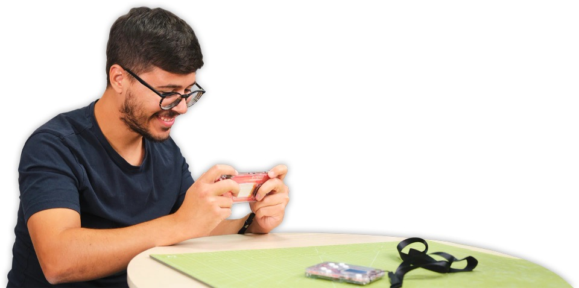

# CircuitMess ByteBoi Rev. 2
- Status: completed (build verified)
- Ref: https://circuitmess.com/products/byteboi-2-0
- Ref: https://github.com/CircuitMess/ByteBoi-Firmware
- Ref: https://github.com/CircuitMess/ByteBoi-Library

Button mapping:
- Start: Select + A
- Menu: Select + B
- Option: Select + Up

# Hardware info
- ESP32
- 320x240 TFT path (ST7789/ILI9341-compatible driver path in retro-go)
- microSD storage
- Shift-register based button input on rev2 hardware

# Verification links (source of rev2 mapping)
- Device init and revision switch (`v2_0` + `Pins3`):  
  https://github.com/CircuitMess/ByteBoi-Library/blob/master/src/ByteBoi.cpp
- Rev2 pin definitions (`Pins3`):  
  https://github.com/CircuitMess/ByteBoi-Library/blob/master/src/PinDef.cpp
- Rev2 display panel path (`panel3`, ST7789):  
  https://github.com/CircuitMess/ByteBoi-Library/blob/master/src/ByteBoiDisplay.cpp
- Rev2 shift-register input implementation and bit remap:  
  https://github.com/CircuitMess/ByteBoi-Library/blob/master/src/ByteBoi2Input.cpp  
  https://github.com/CircuitMess/ByteBoi-Library/blob/master/src/ByteBoi2Input.h
- Firmware repo (integration context):  
  https://github.com/CircuitMess/ByteBoi-Firmware

# Notes
- This target intentionally maps `BTN_C` from ByteBoi firmware semantics to `Select` in retro-go to preserve the same Start/Menu virtual combos used by rev1.

# Flash capacity and app selection
- This target is currently configured for **4MB flash** (`components/retro-go/targets/byteboi-rev2/sdkconfig`).
- `.fw` images from SD-card are **not** supported for this target (`FW_FORMAT = "none"` in `env.py`), so use `.img` + USB flashing.
- App set selection is controlled by `rg_tool.py` app arguments:
  - Explicit list: `python rg_tool.py --target byteboi-rev2 build-img <apps...>`
  - `all` uses `DEFAULT_APPS` from `components/retro-go/targets/byteboi-rev2/env.py` (it does **not** mean every app in `PROJECT_APPS`).

## Verified size examples
- Fits (default `all` for this target):
  - `python rg_tool.py --target byteboi-rev2 build-img all`
  - Current default app set: `launcher retro-core gwenesis fmsx`
  - Result: **3.688 MB**
- Fits (example **without DOOM**):
  - `python rg_tool.py --target byteboi-rev2 build-img launcher retro-core gwenesis fmsx`
  - Result: **3.688 MB**
- Does not fit a 4MB device:
  - `python rg_tool.py --target byteboi-rev2 build-img launcher retro-core prboom-go gwenesis fmsx`
  - Result: **4.500 MB** (too large for 4MB flash hardware)

## Pokemon-focused platform selection (GB / GBA)
- In this repository snapshot:
  - **GB/GBC** are available via `retro-core` (launcher mapping points `gb`/`gbc` to `retro-core`).
  - **GBA** launcher entry exists, but points to app partition `gbsp`, and `gbsp` is not present in current `rg_tool.py` app choices.
  - Ref (launcher mapping): https://github.com/ducalex/retro-go/blob/master/launcher/main/applications.c
  - Ref (current app choices): https://github.com/ducalex/retro-go/blob/master/rg_tool.py

- Working example today (GB/GBC Pokemon titles):
  - `python rg_tool.py --target byteboi-rev2 build-img launcher retro-core gwenesis fmsx`
  - GB/GBC games (including Pokemon GB/GBC titles) run from the `retro-core` app.

- Desired GB + GBA example (requires adding `gbsp` app support first):
  - `python rg_tool.py --target byteboi-rev2 build-img launcher retro-core gbsp`
  - If you try this now, `rg_tool.py` rejects `gbsp` as an invalid app choice.
  - To make it work, add the `gbsp` app implementation to the repo and register it in `PROJECT_APPS` in `rg_tool.py`, then re-run the fit checks.

## Flashing selected apps (USB)
- Build + install selected set:
  - `python rg_tool.py --target byteboi-rev2 --port <PORT> install launcher retro-core gwenesis fmsx`
- Or flash generated image manually:
  - `esptool.py write_flash --flash_size detect 0x0 retro-go_<version>_byteboi-rev2.img`

## Concrete install steps (ByteBoi Rev2)
1. Enter the retro-go repo and export ESP-IDF:
   - `cd <path-to-retro-go>`
   - `source <path-to-esp-idf>/export.sh`
   - If `xtensa-esp32-elf` is missing in your shell, add:
     - `export PATH="$HOME/.espressif/tools/xtensa-esp32-elf/esp-12.2.0_20230208/xtensa-esp32-elf/bin:$PATH"`
2. Build the default Rev2 image (current default: `launcher retro-core gwenesis fmsx`):
   - `python rg_tool.py --target byteboi-rev2 build-img all`
3. Connect ByteBoi Rev2 over USB and find the serial port (for example `/dev/cu.usbmodem*` on macOS).
4. Flash directly from sources:
   - `python rg_tool.py --target byteboi-rev2 --port /dev/cu.usbmodemXXXX install all`
5. Or flash the generated image file:
   - `esptool.py --chip esp32 --port /dev/cu.usbmodemXXXX --baud 460800 write_flash --flash_size detect 0x0 retro-go_<version>_byteboi-rev2.img`
6. Put ROMs on the microSD card in `/retro-go/roms/<system>/` (for example `/retro-go/roms/nes`), then boot the device.

# Images

